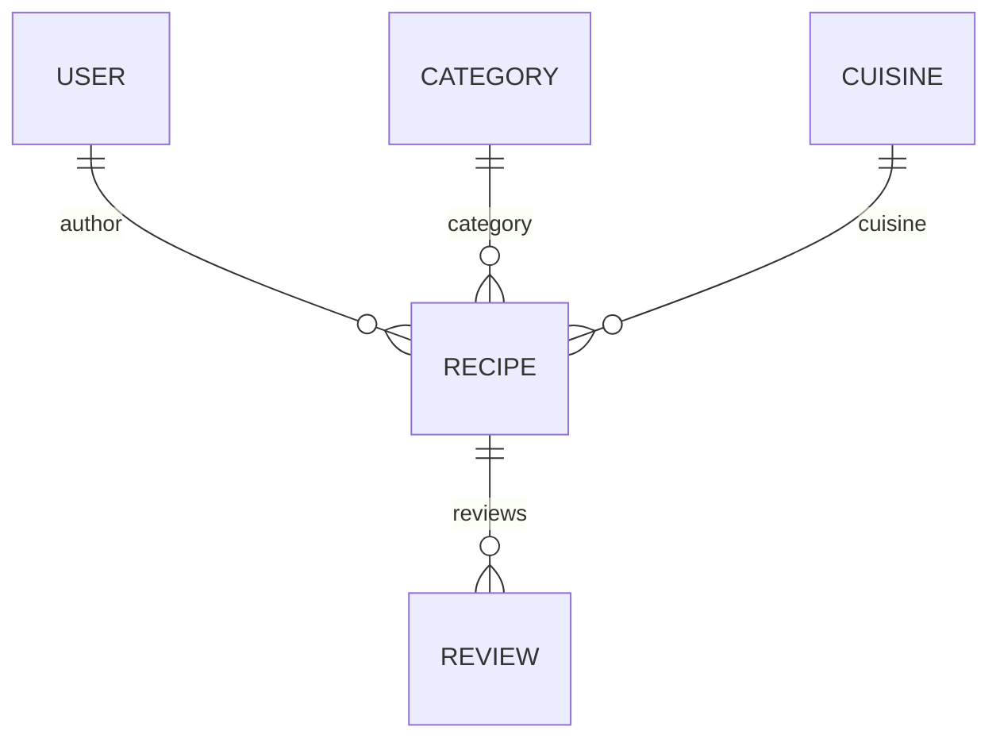

# Recipebook — сайт рецептов (Django + Django REST Framework)

Веб-приложение «Recipebook» — каталог рецептов казахской и мировой кухни: ингредиенты и способ приготовления,
поиск по названию, фильтры по категории и кухне, отзывы с оценками, регистрация и вход.
Проект выполняется по неделям курса Backend; в репозитории накапливается весь пройденный материал.

## Возможности

- каталог рецептов с поиском, фильтром по категориям и национальным кухням, сортировкой;
- карточка рецепта: ингредиенты, шаги приготовления, время, порции, сложность;
- отзывы и оценки рецептов (1–5), средняя оценка;
- регистрация, вход и выход пользователей;
- админ-панель Django;
- REST API на Django REST Framework (сериализаторы, CRUD для рецептов, категорий, кухонь и отзывов,
  выборки по связанным сущностям, проверка данных и корректные коды ошибок);
- фильтрация, текстовый поиск, сортировка и пагинация списка рецептов в API (по 5 записей на страницу).

## Технологии

Python 3.12, Django, Django REST Framework, django-filter, SQLite, HTML/CSS/JS (шаблоны Django), Postman.

## Структура проекта

```
recipebook/
├── recipebook/            # настройки проекта (settings.py, urls.py, wsgi.py, asgi.py)
├── apps/
│   └── recipes/           # приложение (можно перенести в другой проект целиком)
│       ├── migrations/
│       ├── fixtures/      # тестовые данные
│       ├── templates/
│       ├── management/commands/seed_reviews.py
│       ├── management/commands/seed_demo_recipes.py
│       ├── admin.py  apps.py  forms.py  models.py  views.py  tests.py
│       ├── serializers.py     # сериализаторы DRF (недели 7–8)
│       ├── api_views.py       # представления DRF (недели 7–8)
│       ├── api_urls.py        # маршруты API (недели 7–8)
│       ├── filters.py         # фильтр, поиск, сортировка (неделя 9)
│       └── pagination.py      # пагинация (неделя 9)
├── docs/
│   ├── ER_diagram.md
│   └── Recipebook_API.postman_collection.json
├── manage.py
├── requirements.txt
└── README.md
```

## Запуск проекта

```bash
# 1. клонировать репозиторий и перейти в папку проекта
git clone <ССЫЛКА_НА_РЕПОЗИТОРИЙ>
cd recipebook

# 2. виртуальное окружение
python -m venv .venv
.venv\Scripts\activate            # Windows
# source .venv/bin/activate       # macOS / Linux

# 3. зависимости
pip install -r requirements.txt     # включает django-filter

# 4. база данных
python manage.py migrate
python manage.py loaddata <ИМЯ_ФАЙЛА_ИЗ_apps/recipes/fixtures>   # тестовые данные
python manage.py createsuperuser                                  # для входа в /admin/

# 5. проверка и запуск
python manage.py check
python manage.py runserver
```

Сайт: http://127.0.0.1:8000/ · Админка: http://127.0.0.1:8000/admin/ ·
API (Browsable API): http://127.0.0.1:8000/api/drf/recipes/

Необязательно:
- `python manage.py seed_demo_recipes` добавляет 14 демо-рецептов, чтобы в базе было не менее 20 записей
  (`--clear` удаляет только их);
- `python manage.py seed_reviews` добавляет демо-отзывы к имеющимся рецептам (`--clear` удаляет только их).

## Модели и связи

| Модель | Поля | Связи |
|---|---|---|
| `Category` | name, icon | 1 категория → много рецептов |
| `Cuisine` | name | 1 кухня → много рецептов |
| `Recipe` | title, description, ingredients, instructions, cooking_time, servings, difficulty, created_at | `category` → Category, `cuisine` → Cuisine, `author` → User (все `SET_NULL`) |
| `Review` | author_name, rating (1–5), comment, created_at | `recipe` → Recipe (`CASCADE`, `related_name="reviews"`) |

ER-диаграмма: [docs/ER_diagram.md](docs/ER_diagram.md)


```mermaid
erDiagram
    USER ||--o{ RECIPE : "author"
    CATEGORY ||--o{ RECIPE : "category"
    CUISINE ||--o{ RECIPE : "cuisine"
    RECIPE ||--o{ REVIEW : "reviews"
```

## REST API (префикс `/api/drf/`)

| Метод | URL | Назначение |
|---|---|---|
| GET, POST | `/api/drf/recipes/` | список рецептов (с фильтрами, поиском, сортировкой и пагинацией) / создание |
| GET, PUT, PATCH, DELETE | `/api/drf/recipes/<id>/` | один рецепт (GET — вместе с отзывами) |
| GET | `/api/drf/recipes/<id>/reviews/` | отзывы рецепта |
| GET, POST | `/api/drf/categories/` | список категорий / создание |
| GET, PUT, PATCH, DELETE | `/api/drf/categories/<id>/` | одна категория |
| GET | `/api/drf/categories/<id>/recipes/` | рецепты категории |
| GET, POST | `/api/drf/cuisines/` | список кухонь / создание |
| GET, PUT, PATCH, DELETE | `/api/drf/cuisines/<id>/` | одна кухня |
| GET | `/api/drf/cuisines/<id>/recipes/` | рецепты кухни |
| GET, POST | `/api/drf/reviews/` | отзывы / создание отзыва |
| GET, PUT, PATCH, DELETE | `/api/drf/reviews/<id>/` | один отзыв |

Ранее реализованные ручные JSON-маршруты (`/api/recipes/`, `/api/recipes/<id>/`) сохранены.

В ответе рецепта связанные данные выводятся рядом с идентификаторами: `category_detail`, `cuisine_detail`,
`category_name`, `cuisine_name`, `average_rating`, `reviews_count`. При записи передаются только id
(`"category": 2`, `"cuisine": 1`).

### Пример: создание рецепта

```http
POST /api/drf/recipes/
Content-Type: application/json

{
  "title": "Плов",
  "description": "Сытный рассыпчатый плов.",
  "ingredients": "1 кг риса\n1 кг моркови",
  "instructions": "Промыть рис.\nОбжарить мясо.",
  "cooking_time": 90,
  "servings": 6,
  "difficulty": "medium",
  "category": 2,
  "cuisine": 1
}
```
Ответ: `201 Created` и созданный рецепт.

### Ошибки

| Ситуация | Код | Ответ |
|---|---|---|
| рецепта / категории / кухни с таким id нет | 404 | `{"detail": "No Recipe matches the given query."}` |
| нет обязательного поля | 400 | `{"title": ["This field is required."], ...}` |
| название короче 2 символов | 400 | сообщение `validate_title` |
| несуществующий `category` / `cuisine` / `recipe` | 400 | `Invalid pk "99999" - object does not exist.` |
| оценка вне диапазона 1–5 | 400 | `Ensure this value is less than or equal to 5.` |

При удалении категории или кухни рецепты сохраняются (`SET_NULL`); при удалении рецепта удаляются его отзывы (`CASCADE`).

## Фильтрация, поиск, сортировка и пагинация (неделя 9)

Все параметры применяются к списку рецептов `GET /api/drf/recipes/` и сочетаются друг с другом.
В списке по 5 записей на страницу.

| Параметр | Что делает | Допустимые значения | Пример |
|---|---|---|---|
| `category` | фильтр по категории | id категории | `?category=2` |
| `cuisine` | фильтр по национальной кухне | id кухни | `?cuisine=3` |
| `difficulty` | фильтр по сложности | `easy`, `medium`, `hard` | `?difficulty=easy` |
| `min_time` | время приготовления не меньше, мин | целое число | `?min_time=30` |
| `max_time` | время приготовления не больше, мин | целое число | `?max_time=60` |
| `search` | текстовый поиск | любой текст; несколько слов – все должны встретиться | `?search=плов` |
| `ordering` | сортировка | `created_at`, `cooking_time`, `title`, `servings`; `-` перед именем – по убыванию; несколько полей через запятую | `?ordering=-created_at` |
| `page` | номер страницы | 1, 2, 3, … | `?page=2` |

Поиск идёт по полям: `title`, `description`, `ingredients`, название категории и название кухни.
По умолчанию список отсортирован от новых рецептов к старым (`-created_at`).

Примеры (параметры можно комбинировать):

```
GET /api/drf/recipes/?difficulty=easy
GET /api/drf/recipes/?category=2&difficulty=hard
GET /api/drf/recipes/?max_time=30&ordering=cooking_time
GET /api/drf/recipes/?search=күріш&ordering=-created_at
GET /api/drf/recipes/?difficulty=easy&cuisine=3&search=а&ordering=cooking_time&page=1
GET /api/drf/recipes/?page=2
```

Формат ответа (пагинация):

```json
{
  "count": 23,
  "next": "http://127.0.0.1:8000/api/drf/recipes/?page=2",
  "previous": null,
  "results": [ { "id": 14, "title": "...", "...": "..." } ]
}
```
`count` – сколько записей найдено всего (с учётом фильтров), `results` – не более 5 записей текущей страницы,
`next` и `previous` – ссылки на соседние страницы. Параметры фильтра сохраняются в ссылках.

Ошибки параметров:

| Ситуация | Код | Ответ |
|---|---|---|
| несуществующая страница (`?page=999`) | 404 | `{"detail": "Invalid page."}` |
| недопустимое значение фильтра (`?difficulty=super`, `?category=abc`) | 400 | сообщение об ошибке для поля |
| неизвестное поле в `ordering` | 200 | параметр игнорируется, действует порядок по умолчанию |
| ничего не найдено | 200 | `{"count": 0, "results": []}` |

Особенности реализации:
- Фильтры (`category`, `cuisine`, `difficulty`, `min_time`, `max_time`) – `django-filter`, класс `RecipeFilter`.
- В SQLite поиск по кириллице чувствителен к регистру («плов» не находит «Плов»), поэтому написан
  `MultiCaseSearchFilter`: он проверяет несколько вариантов написания слова (как введено, строчными, прописными,
  с заглавной первой буквой).
- К сортировке добавляется `id` (`StableOrderingFilter`), чтобы при одинаковых значениях записи не перемешивались
  между страницами.
- Пагинация подключена только к списку рецептов; списки категорий, кухонь и отзывов остались без пагинации.

### Настройки (`settings.py`)

```python
INSTALLED_APPS = [
    # ...
    "rest_framework",
    "django_filters",
    "apps.recipes",
]

REST_FRAMEWORK = {
    "DEFAULT_FILTER_BACKENDS": ["django_filters.rest_framework.DjangoFilterBackend"],
}
```

## Проверка работы

1. `python manage.py check` — без ошибок.
2. Postman: Import → `docs/Recipebook_API.postman_collection.json`, запустить всю коллекцию
   (папки «Сәтті», «Қателер», «9-апта»: сүзгі, іздеу, сұрыптау, пагинация).
   PUT и DELETE применяются только к рецепту, созданному самой коллекцией, поэтому реальные данные не затрагиваются.
3. Или открыть страницы API в браузере (DRF Browsable API) и проверить формы создания.

## Ход работы по неделям

| Неделя | Что сделано |
|---|---|
| 5 | Выбор темы, структура проекта, модели, каталог рецептов, шаблоны, авторизация |
| 6 | REST API и CRUD на обычных представлениях Django (JsonResponse) |
| 7 | Установка DRF, `ModelSerializer`, generic views, валидация, проверка в Browsable API и Postman |
| 8 | Связанные модели в API: сериализаторы Category, Cuisine, Review, CRUD, выборки по связанным сущностям, вложенный вывод, коллекция Postman, ER-диаграмма |
| 9 | django-filter, фильтрация по category/cuisine/difficulty/времени, текстовый поиск, сортировка, пагинация по 5, не менее 20 записей, документация параметров |

## Принятые решения и найденные ошибки

- **Приложение в папке `apps/`.** Приложение перенесено в `apps/recipes`, чтобы переносить его в другой проект целиком.
  В `apps.py` задано `name = "apps.recipes"` и `label = "recipes"`, чтобы не потерять миграции и данные.
  Типичная ошибка после переноса — `ModuleNotFoundError: No module named 'recipes'`: в `INSTALLED_APPS` и
  импортах нужно писать `apps.recipes`.
- **DRF под отдельным префиксом `/api/drf/`.** Так новые маршруты не конфликтуют со старыми JSON-маршрутами и не затрагивают дизайн сайта.
- **Запись — по id, чтение — вложенно.** Клиент передаёт `"category": 2`, а в ответе получает ещё и `category_detail`.
- **Предупреждение `urls.W005` (namespace не уникален).** Возникло из-за двойного `include` одного и того же `api_urls`; оставлено одно подключение.
- **`JSON parse error` в Postman.** Причиной была лишняя запятая и фигурная скобка после скопированного JSON; исправлено вручную.
- **Пагинация меняет формат ответа.** Список рецептов теперь возвращает объект `{count, next, previous, results}`
  вместо массива; тесты Postman-коллекции обновлены под этот формат.
- **Регистр в поиске на SQLite.** Стандартный `icontains` не различает регистр только для латиницы, поэтому для кириллицы
  добавлен собственный фильтр поиска (см. выше).
