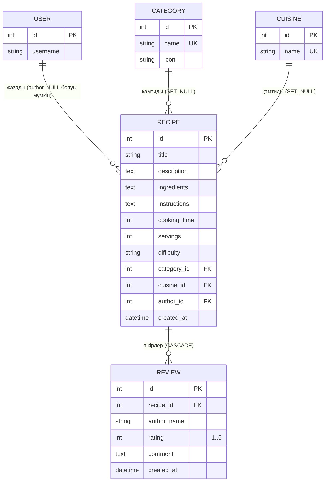

# ER-диаграмма (Mermaid)

GitHub бұл диаграмманы README ішінде автоматты көрсетеді.

```mermaid
erDiagram
    USER ||--o{ RECIPE : "жазады (author, NULL болуы мүмкін)"
    CATEGORY ||--o{ RECIPE : "қамтиды (SET_NULL)"
    CUISINE ||--o{ RECIPE : "қамтиды (SET_NULL)"
    RECIPE ||--o{ REVIEW : "пікірлер (CASCADE)"

    USER { int id PK
           string username }
    CATEGORY { int id PK
               string name UK
               string icon }
    CUISINE { int id PK
              string name UK }
    RECIPE { int id PK
             string title
             text description
             text ingredients
             text instructions
             int cooking_time
             int servings
             string difficulty
             int category_id FK
             int cuisine_id FK
             int author_id FK
             datetime created_at }
    REVIEW { int id PK
             int recipe_id FK
             string author_name
             int rating "1..5"
             text comment
             datetime created_at }
```
